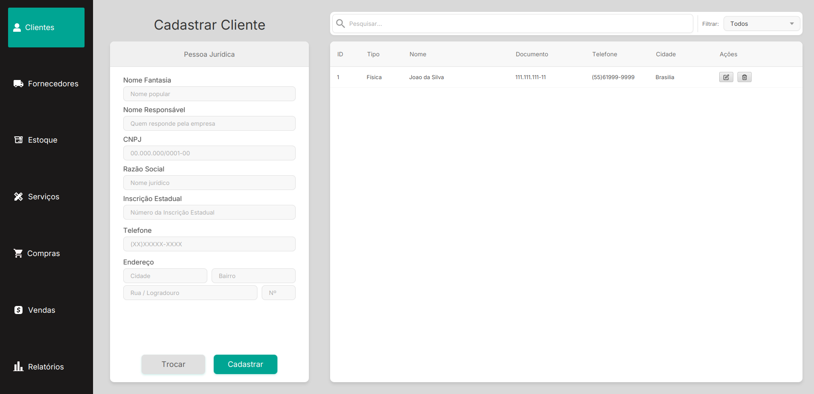
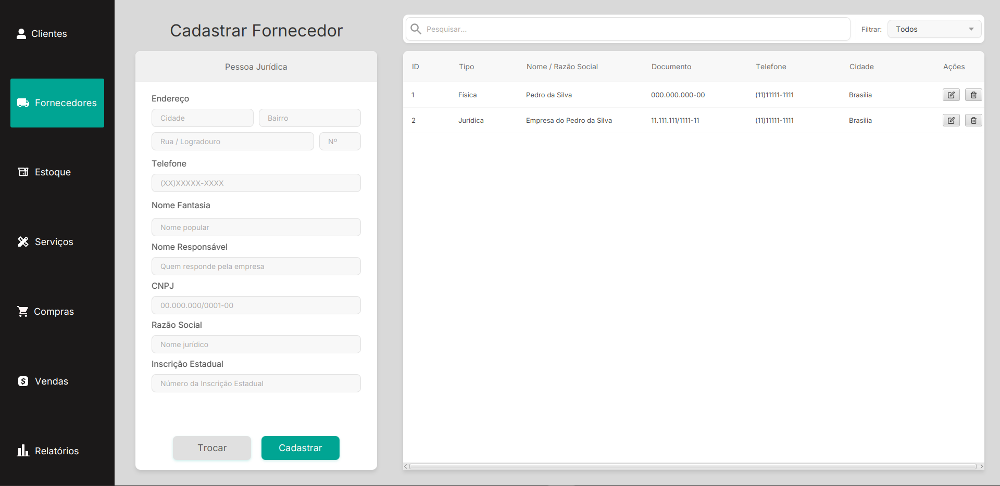
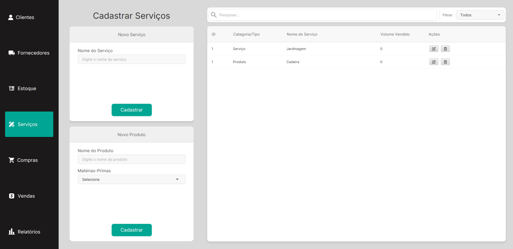
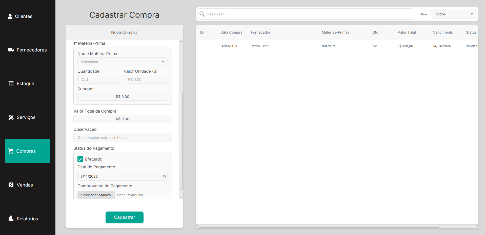
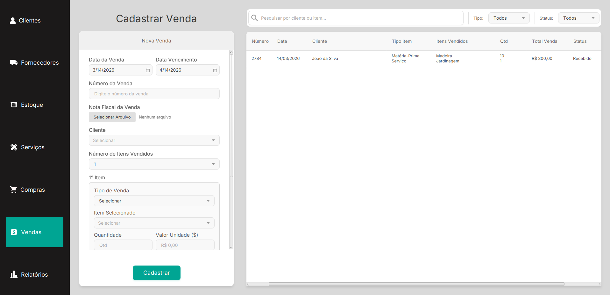
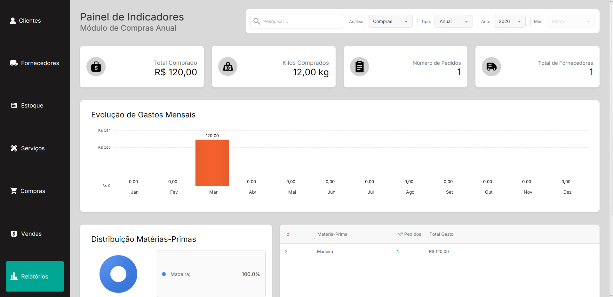

# Sistema de Gerenciamento de Estoque e Vendas

## 1. Descrição
Este projeto é uma aplicação *desktop* desenvolvida sob demanda (trabalho *freelance*) para uma empresa privada. O sistema atua como uma solução completa e centralizada para o **gerenciamento de estoque, fluxo de caixa (vendas e compras) e carteira de clientes e fornecedores**.

O foco do desenvolvimento foi entregar um produto final independente e com uma interface de usuário (UI) responsiva e esteticamente agradável. O sistema foi arquitetado para garantir que o cliente final não precise instalar dependências externas (como o Java ou servidores de banco de dados complexos) para rodar o software, facilitando a implantação.

## 2. Tecnologias e Componentes Utilizados
* **Linguagem:** Java
* **Interface Gráfica:** JavaFX (com FXML e estilização em CSS)
* **Banco de Dados:** SQLite (Embarcado e gerado automaticamente)
* **Gerenciamento de Dependências:** Maven
* **Empacotamento:** `jpackage` (Geração de instaladores nativos `.exe` e `.deb` com JRE embutida)

## 3. Telas do Sistema
Abaixo estão as principais interfaces desenvolvidas, pensadas para oferecer a melhor experiência e usabilidade no dia a dia da empresa:

### Cadastro Cliente 
Cadastro de clientes detalhado separando Pessoas Físicas (PF) e Pessoas Jurídicas (PJ).


### Cadastro Fornecedores
Cadastro de fornecedores detalhado separando Pessoas Físicas (PF) e Pessoas Jurídicas (PJ).


### Estoque
Controle visual e prático das matérias-primas disponíveis para comercialização.
)

### Gestão de Serviços
Controle visual e prático dos serviços e produtos disponíveis para comercialização


### Gestão de Compras
Controle estruturado de entrada de mercadorias e matérias-primas.


### Gestão de Vendas
Registro de transações, vinculação de clientes a itens vendidos, cálculo automático de totais e anexo de comprovantes.


### Relatórios
Módulo com indicadores de compra e venda (Total, Anual ou Mensal), gráficos percentuais e tabelas detalhadas.



---


## 4. Como Compilar e Empacotar (Deploy)
O sistema utiliza o `jpackage` para gerar o instalador final do produto com o Java Runtime Environment (JRE) embutido.

### Windows (.exe)
Rode os comandos abaixo via PowerShell:

```powershell
# 1. Compila o código novo
mvn clean package

# 2. Limpa e prepara o deploy (lembrando que seu JAR não tem o sufixo -shaded)
if (Test-Path deploy) { Remove-Item -Recurse -Force deploy }
mkdir deploy
copy target\Gerenciador-1.0-SNAPSHOT.jar deploy\

# 3. Cria o executável
jpackage --name "GerenciadorApp" `
--input deploy\ `
--main-jar Gerenciador-1.0-SNAPSHOT.jar `
--main-class com.gerenciador.app.Launcher `
--type exe `
--win-shortcut `
--win-menu `
--win-dir-chooser
```
### Linux (.deb)
Rode os comandos abaixo via Bash

```powershell
# 1. Compila o código novo
mvn clean package

# 2. Limpa e prepara o diretório de entrada (input)
rm -rf deploy
mkdir deploy
cp target/Gerenciador-1.0-SNAPSHOT.jar deploy/

# 3. Cria o pacote instalável para Linux (.deb)
jpackage --name "gerenciador-app" \
--input deploy/ \
--main-jar Gerenciador-1.0-SNAPSHOT.jar \
--main-class com.gerenciador.app.Launcher \
--type deb \
--linux-shortcut \
--linux-menu-group "Office" \
--linux-app-category "Office" \
--description "App gerenciador de estoque e vendas \
--vendor "Othavio Bolzan"
```
---


## Desenvolvedor

<table border="1" style="border-collapse: collapse; width: 100%;">
<tbody>
<tr>
<td align="center" style="padding: 10px;">
<a href="https://github.com/bolzanMGB">

</a>
<br />
<b>Othavio Bolzan</b>
</td>
</tr>
</tbody>

</table>
